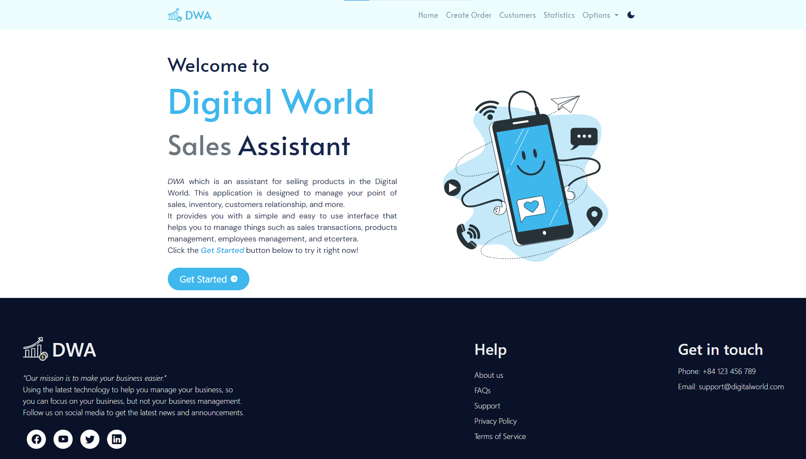

# NodeJS FinalProject
Welcome you to our project. This is a project for the final exam of NodeJS course. This project is mainly about a website for point of sale, which is used for selling products and managing orders. This project is built with NodeJS, ExpressJS, Docker (for MongoDB), and Bootstrap. We hope you will enjoy our project.
For more information, please read the `report.docx` file in the root directory of this project. Note that this file is written in <b>Vietnamese</b>.

## Getting started
Before you start, please make sure that you have installed NodeJS and Docker on your computer. If you haven't, please install them first.
### 1. Clone this repository to your computer.
### 2. Run the following command to start the MongoDB server:
```
docker-compose up -d
```
### 3. Run the following command to install all the dependencies:
```
npm install
```
### 4. Run the following command to start the server:
```
npm start
```
When the message `Connect to DB successfully !!!` is shown, the server is ready to use.
### 5. Open your browser and go to [localhost:3000](http://localhost:3000) to see the website.
The Welcome page will be shown. You can click on the `Get Started` button to go to the Login page. If you have already logged in, you will be redirected to the Home page depending on your role. <br>

There are 2 types of users: `Admin` and `User`. <br>
The default admin account is: <br>
Username: `admin` <br>
Password: `admin` <br>
The default user account is: <br>
Username: `johndoe` <br>
Password: `johndoe` <br>
You can create a new user account by adding a new user in the admin page. [...] <br>
### 6. You can stop the server by pressing `Ctrl + C` and stop the MongoDB server by running the following command:
```
docker-compose down
```
For more information, please read the [requirements](https://docs.google.com/document/d/13biAcC49Pkg3FuyOmL-IW5c5hTNQRvzO) (in English).

## Demo data
We have provided some demo data for you to test the website, it's just a simple data for `products` collection. . You can find the demo data in the `data/products.js` file. Or you can simply click [here](./data/products.js).
## Presentation video
This is the presentation video link of our project:
[Drive](https://drive.google.com/drive/folders/1L_6lbX8y96PKw9lDCWOpZjE84qZcCmT7?usp=sharing)
You can also find the link in the `readme.txt` file in the root directory of this project.
Or click [here](./readme.txt).

## Thank you for reading. Have a nice day!